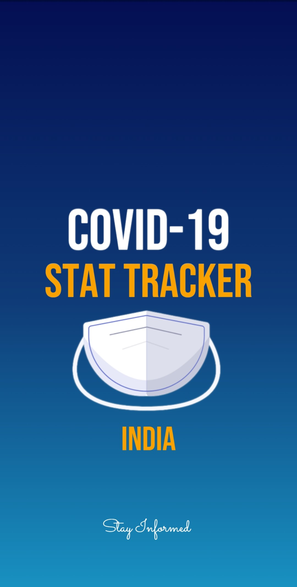
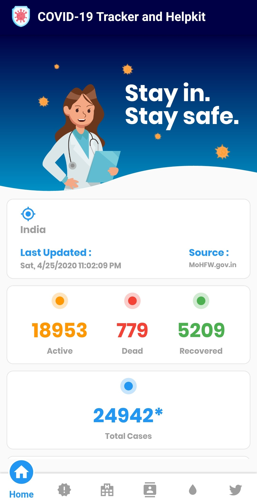
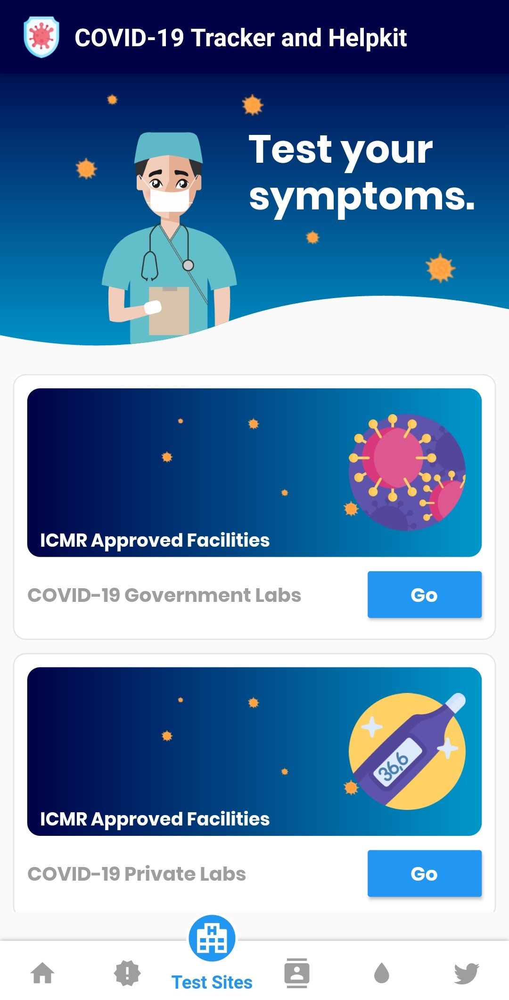
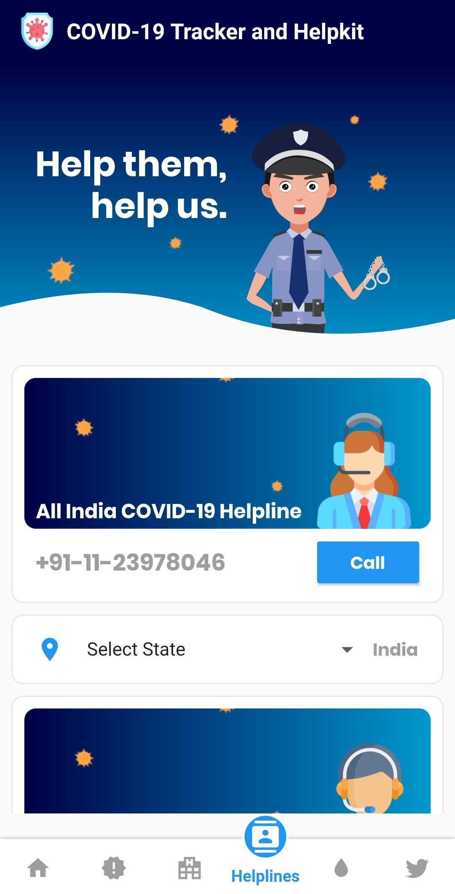
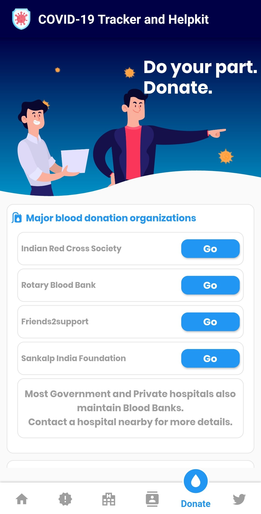
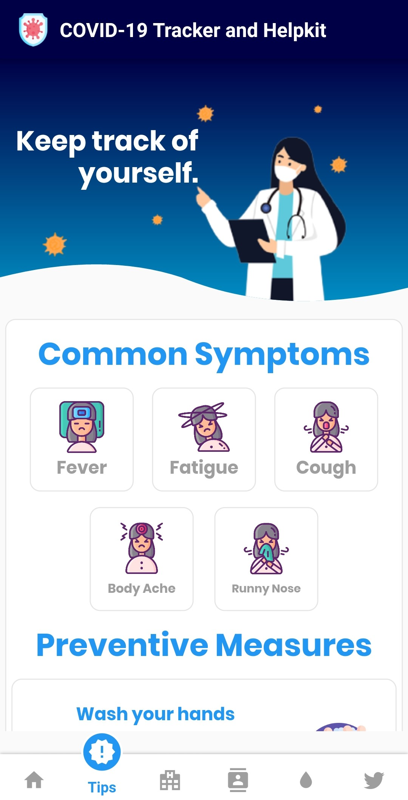

# corona_tracker

Splash Screen             |  Primary Tracker
:-------------------------:|:-------------------------:
  |  

Test Site Details             |  Helpline Details
:-------------------------:|:-------------------------:
  |  

Donate details            |  Symptoms Details
:-------------------------:|:-------------------------:
  |  

The COVID-19 Tracker (INDIA) app is a toolkit for tracking the COVID-19 coronavirus pandemic in India. The app sources it's data from the official Indian Ministry of Health and Family Welfare.

Most people who fall sick with COVID-19 will experience mild to moderate symptoms and recover without special treatment. The virus that causes COVID-19 is mainly transmitted through droplets generated when an infected person coughs, sneezes, or exhales. These droplets are too heavy to hang in the air, and quickly fall on floors or surfaces. You can be infected by breathing in the virus if you are within close proximity of someone who has COVID-19, or by touching a contaminated surface and then your eyes, nose or mouth.

The app's tracker is updated automatically from the government source and is re-freshable. The toolkit also features numerous other features. Some of them involve displaying general symptoms and prescribed preventive measures.  

The app maintains a list of medical centers, both government based and private based, that have been approved by the Indian Council of Medical Research (ICMR). It also features a useful list of contacts that maybe needed in emergency situations. This includes a state-specific COVID-19 helpline number. 

Several organizations that seek donors are linked in the interface. The app can facilitate the registration of a person as a blood donor to the major blood donation organizations in India. It also links funds that involve monetary help. GoFundMe pages of individual causes, of local NGOs and of the general public are also linked.

The app features a recent tweets section which sports tweets and updates from various governing bodies as well as fact checking organizations. The recent tweets section features the twitter pages of the Indian Ministry of Health and Family Welfare (MoHFW), the World Health Organization(WHO), the Indian Council of Medical Research (ICMR) and the Fact Checking branch of the Press Information Bureau of India (PIB).

UI inspiration : https://www.uplabs.com/posts/coronavirus-information-concept 

A few resources to get you started on your first Flutter project:

- [Lab: Write your first Flutter app](https://flutter.dev/docs/get-started/codelab)
- [Cookbook: Useful Flutter samples](https://flutter.dev/docs/cookbook)

For help getting started with Flutter, view our
[online documentation](https://flutter.dev/docs), which offers tutorials,
samples, guidance on mobile development, and a full API reference.
